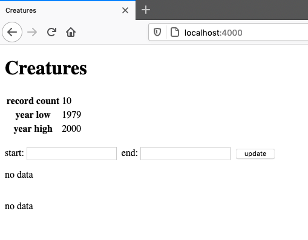
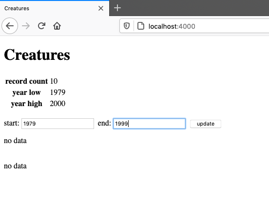
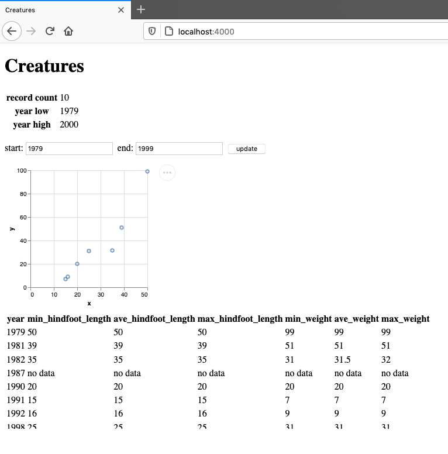

# About

This is the capstone project from the book 
 [_JavaScript For Data Science_](https://js4ds.org/), which provides an 
 introduction to web development geared towards data scientists.
This project brings together everything learned throughout the book into a 
 comprehensive data application.
My implementation builds upon the application in the book slightly by 
 incorporating some of the exercises (e.g. additional tests).


# The Data


The data used in this application contains information on rodents in the 
 Chihuahuan desert near Portal, Arizona.
The data comes from the 
 [Portal Project Teaching Database](https://figshare.com/articles/Portal_Project_Teaching_Database/1314459)
 which provides a simplified version of data from a long term ecological study.
We use a subset of the data (`surveys.csv`) in this project to keep things
 simple.

# The Application

The application provides a summary of the rodent survey data through a plot
 and a table.
We can select a range of years we are interested in and the plot and table will
 update accordingly.
It's pretty simple, nothing fancy.
The data analysis is very basic and it's nothing much to look at.
But the point with this project is to see how all the pieces fit together and 
 illustrate some functionality we might want for a data application.
Indeed, having a plot, a table, and a filter are realistic things we 
 would want to have in a data exploration application.

When the application launches, it will look like this:

.

Displayed here are the number of available records and the range of available
 years.
In the `start` and `end` boxes, you can type in the starting and ending years
 that you want to see data for.
For example, we could see a summary of the surveys from 1979 to 1999:



You may notice the two paragraphs saying 'no data.'
This is because the application doesn't know what years you want to look at, so
 it doesn't know what data to use.
Once you click the `update` button, it will set the year range and the page
 will update with a plot and a table summarizing the data in this range.
For example,



Again, the app is pretty simple.
But I think going from knowing virtually nothing about web development to a 
 functioning full stack application in a few weeks is quite impressive!

# Installation

You can install this application by cloning this repository.

```
git clone https://github.com/asbates/js4ds-capstone
```

You will also need need to have [Node](https://nodejs.org/en/download/)
 installed, unless you already have it.
Within the project directory, run `npm install` to install the dependencies.

# Usage

Once you have everything installed, you can run the application locally as 
 follows.
Open up two terminal windows, one for the front end and one for
 the back end (server).
In one terminal, run

```
node back/driver.js data/data.csv
```

This starts the server and tells it what data to use.
In the other terminal window, run

```
npm run dev front/index.html
```

This will use [Parcel](https://parceljs.org/) to start a development server for
 the front end.
Finally, navigate to `http://localhost:4000` in a browser and you should see
 the landing page from above.

If you're wondering why all this bother with the local installation and why 
 not just provide a link to the live site, well, I did think about that.
In fact, I did try to get it working on [Glitch](https://glitch.com/) because
 the book suggested the platform.
But I couldn't quite figure it out.
If you have suggestions, please let me know!
And really, since this is such a simple application, it's probably not worth it.
I can figure out deployment when I have something more substantial to share.

